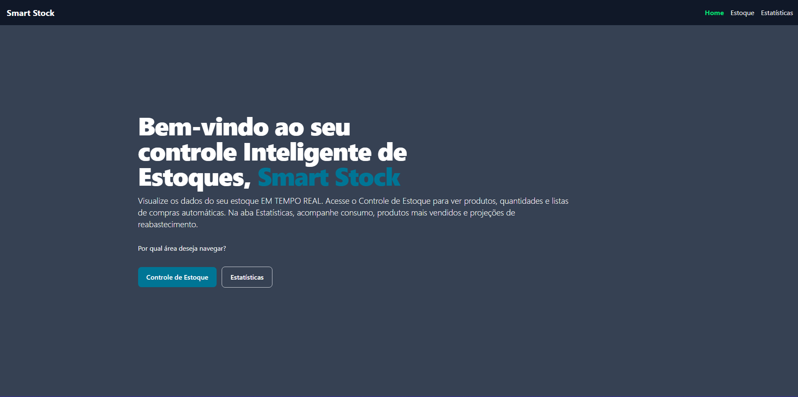
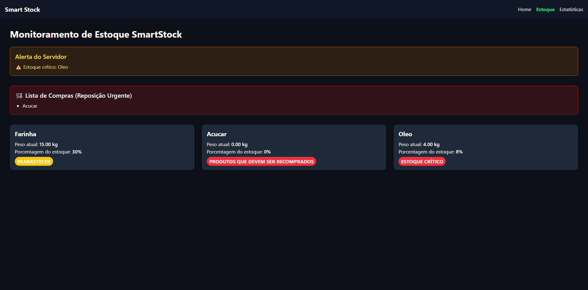
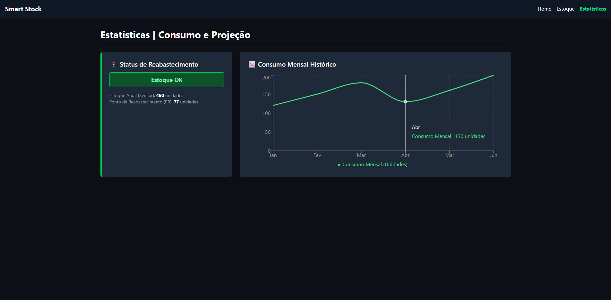
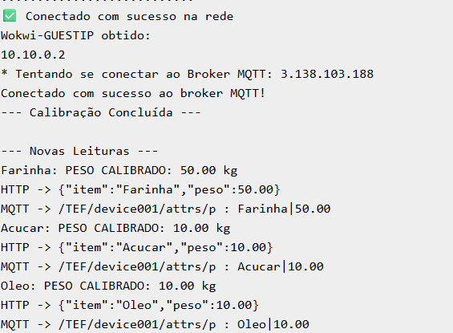
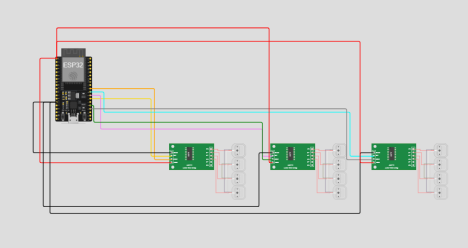

# SMART STOCK

**Sistema IoT de Monitoramento de Estoque com Dashboard em Tempo Real**

---

## 🧠 Descrição do Projeto
O **Smart Stock** é um sistema IoT inteligente para monitorar produtos em estoque, registrando peso e status dos itens em tempo real. Os dados são enviados via **MQTT** ou **HTTP** para um backend que alimenta um dashboard web, permitindo decisões rápidas sobre reposição ou reabastecimento.

---

## 🔗 Simulação Wokwi
[Visualizar simulação no Wokwi](https://wokwi.com/projects/447428449528453121)  

---

## 🎯 Problema
Estoque de produtos em armazéns ou cozinhas sofre com:

- 📉 Falta de monitoramento em tempo real  
- 🔄 Dificuldade para saber quando reabastecer ou recomprar  
- ❌ Perdas por produtos vencidos ou esgotados  

---

## 💡 Solução
O Smart Stock monitora continuamente os produtos, mostrando:

- Peso atual de cada item  
- Porcentagem do estoque disponível  
- Status do estoque (OK, Reabastecer, Recomprar)
- Projeção de estoque
- Projeção de compra de itens

O dashboard web permite visualizar tudo em tempo real, com cores e alertas para estoque crítico.

---

## ⚙️ Funcionalidades

- 📡 Conexão automática com Wi-Fi e broker MQTT  
- 🏷️ Leitura de peso dos produtos (simulada ou via sensores reais)  
- 📊 Dashboard com gráficos de consumo e alertas de reposição  
- 🔄 Atualização em tempo real  
- 🛠️ Backend que fornece dados via HTTP (`/dados`)  

---

## 🛠️ Tecnologias Utilizadas

**Front-end:**  
- React + Vite  
- Tailwind CSS → Estilização responsiva  
- Recharts → Gráficos interativos  
- Lucide React → Ícones  

**Backend/Hardware:**  
- ESP32 → Microcontrolador principal (simulação Wokwi)  
- MQTT → Protocolo de comunicação  
- Node.js → Servidor backend  
- Express → Endpoints HTTP  

---

## 📡 Diagrama do Fluxo

                 +-------------------------+
                 |      Sensores           |
                 | Sensores de Peso (HX711 |
                 +---------+---------------+
                           |
                           | Dados brutos
                           v
                   +-------+--------+
                   |     ESP32      |
                   |                |
                   +-------+--------+
                           |
                           | Publica via MQTT
                           v
               +-----------+-----------+
               |      Broker MQTT      |
               |     (porta 1883)      |
               +-----------+-----------+
                           |
                           |  Envia dados 
                           v
           +---------------+-----------------+
           |        Assinatura do Tópico     |
           +---------------+-----------------+
                           |
                           |    Dados recebidos
                           v
                +----------+-----------+
                |  (Node.js Server)    |
                |   (porta 5182)       |
                +----------------------+
                           |
                           |
                           |   Dados normalizados
                           v
                +----------+-----------+
                |      Dashboard       |
                |                      |
                +----------------------+


---

## 📤 Publicação (Publish)
| Tópico | Dado Enviado |
|--------|--------------|
| /TEF/device001/attrs/p | Peso dos produtos |
| /TEF/device001/attrs/s | Status do produto (OK, Reabastecer, Recomprar) |

---

## 📊 Status e Cores do Estoque
| Status | Cor | Descrição |
|--------|-----|-----------|
| OK | 🟢 Verde | Estoque suficiente |
| REABASTECER | 🟡 Amarelo | Estoque baixo |
| RECOMPRAR | 🔴 Vermelho | Produto esgotado ou crítico |

---

## 🚀 Como Executar

### ✅ Passo 1 — Acesse a simulação online
Abra o simulador no Wokwi: [Link da simulação](https://wokwi.com/projects/447703879792623617)

### ✅ Passo 2 — Configure o Wi-Fi e Broker MQTT
``` cpp
const char* default_SSID = "Wokwi-GUEST";
const char* default_PASSWORD = "";
const char* BROKER_MQTT = "3.85.188.98";
const int BROKER_PORT = 1883;

```

### ✅ Passo 3 — Inicie a simulação
Clique em “Start Simulation” no Wokwi

### ✅ Passo 4 — Front-end local
```
git clone [https://github.com/larissashiba/smart-stock]
cd smartstock-frontend
npm install
npm run dev
```
### ✅ Passo 5 — Backend local (opcional)
```
cd backend
node index.js
```
## 📸 Imagens do Projeto 
### Dashboard Completa, com Estoque e Estatísticas em gráficos




### Exemplificando como a conexão bem sucedida se parece no Wokwi e a Montagem




## 🎥 Vídeo Explicativo
